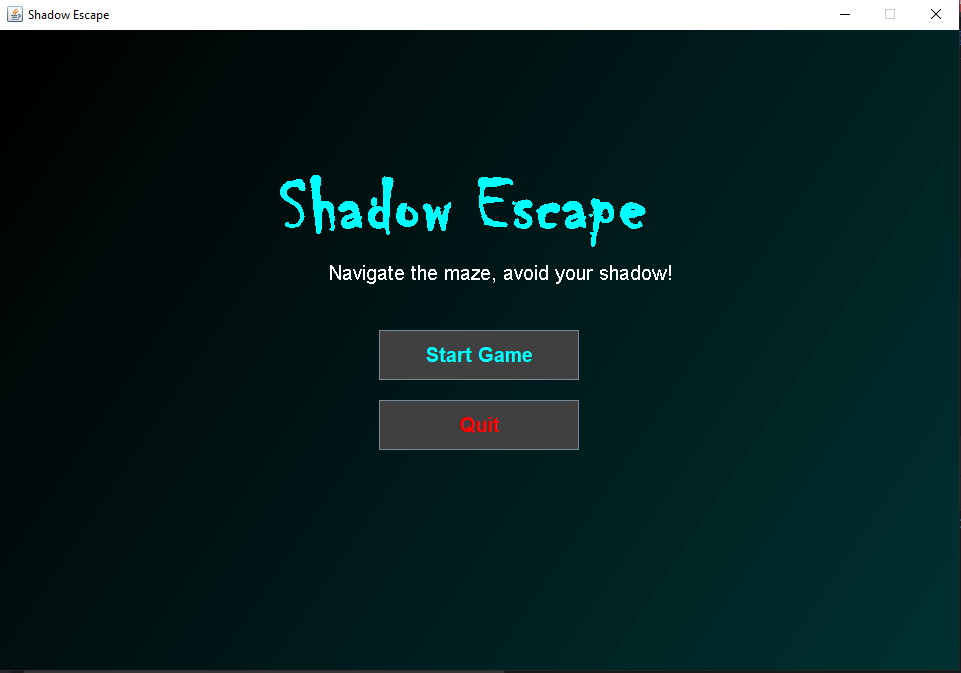

# shadow-escape-game

Welcome to Shadow Escape, a thrilling Java-based maze game where you must outwit your own shadow to reach the exit! Navigate a spooky, randomly generated maze, avoid your shadow that mirrors your moves in reverse, and escape before it's too late. Can you make it out in time?

## Game Overview

In Shadow Escape, you control a cyan player square in a dark, labyrinthine maze. Your shadow, a menacing red square, moves opposite to your every step, hunting you down. The goal is to reach the green exit tile as quickly as possible without colliding with your shadow. A timer tracks your survival, and a main menu adds a polished entry point to the game.

### Features

- Randomized Mazes: Every game generates a unique 30x20 tile maze.

- Challenging Mechanics: The shadow moves inversely to the player, creating strategic gameplay.

- Main Menu: Start or quit from a spooky-themed interface with a gradient background.

- Win/Lose States: Reach the exit to win or collide with the shadow to lose, with restart and menu options.

- Timer: Tracks your escape time, displayed on win.

## How to Play

### 1. Main Menu:

Launch the game to see the "Shadow Escape" menu.

Click Start Game to begin or Quit to exit.

### 2. Gameplay:

- ### Controls:

- Arrow Keys: Move the player (cyan square) up, down, left, or right.
- R: Restart the game after winning or losing.

- M: Return to the main menu after winning or losing.

- ### Objective: 
Guide the player to the green goal tile to win.

- ### Challenge:
Avoid the red shadow, which moves opposite to your inputs (e.g., you move up, it moves down).

- ### Win:
Reach the goal to see "Victory! You Escaped!" with your time.

- ### Lose:
Collide with the shadow to see "Game Over."

## Tips:

- Plan your moves to trap the shadow in dead ends.

- Use the larger 960x640 maze to your advantage, but stay quick!

- Setup Instructions

### Prerequisites

Java Development Kit (JDK): Version 8 or higher (e.g., OpenJDK or Oracle JDK).

IDE (Optional): IntelliJ IDEA, Eclipse, or VS Code for easier development.

Command Line (Optional): For compiling and running manually.

## Directory Structure

ShadowEscape/

├── entities/

│   ├── Player.java

│   ├── Shadow.java

├── game/

│   ├── GameFrame.java

│   ├── GamePanel.java

│   ├── MainMenuPanel.java

├── main/

│   └── game.java

├── objects/

│   ├── GoalTile.java

│   ├── Obstacle.java

├── utils/

│   ├── Constants.java

│   ├── GameTimer.java

│   ├── MazeGenerator.java

├── README.md

├── LICENSE

## Compilation and Running

Clone or Download: Ensure all source files are in the correct package structure as shown above.

## Compile:

- Using an IDE: Import the project and build/run.

### Command Line:
cd ShadowEscape

javac main/game.java

### Run:

- IDE: Run the main.game class.

### Command Line:

java main.game

- Verify: The main menu should appear. Click "Start Game" to play.

### Troubleshooting

- Missing JDK: Install Java from Oracle or OpenJDK.

- Compilation Errors: Ensure files are in the correct packages (main, game, entities, objects, utils).

- Font Issues: The menu uses "Chiller" font. If unavailable, it defaults to a system font.

## Credits

- Developer: [xiao ro] - Original concept and core implementation.

- AI Assistance: Grok - bug fixes, and file generation.

- Inspiration: Classic maze chase games with a unique shadow-twist.

## License

This project is licensed under the MIT License. See the LICENSE file for details.

Escape the shadows, if you dare!